

  <a style= href="" rel="noopener">
    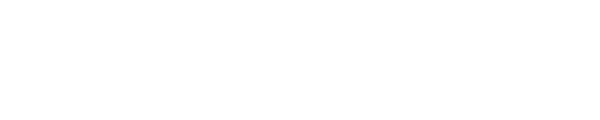
  </a>

   
  
  
   

## Opis projektu

CultureSpot to aplikacja webowa zaprojektowana do łatwego tworzenia, przeglądania i zarządzania wydarzeniami kulturalnymi. 
Użytkownicy mogą przeglądać wydarzenia z różnych dziedzin kultury, takich jak koncerty, wystawy, przedstawienia teatralne czy festiwale. 
Aplikacja umożliwia partnerom tworzenie i publikowanie własnych wydarzeń, co daje organizatorom narzędzie do promocji swoich wydarzeń w łatwy i przyjazny sposób.

## Technologie
- ASP.NET Core (C#)
- React + TypeScript
- PostgreSQL
- NGINX
- REST API
- Docker

## Diagram ERD

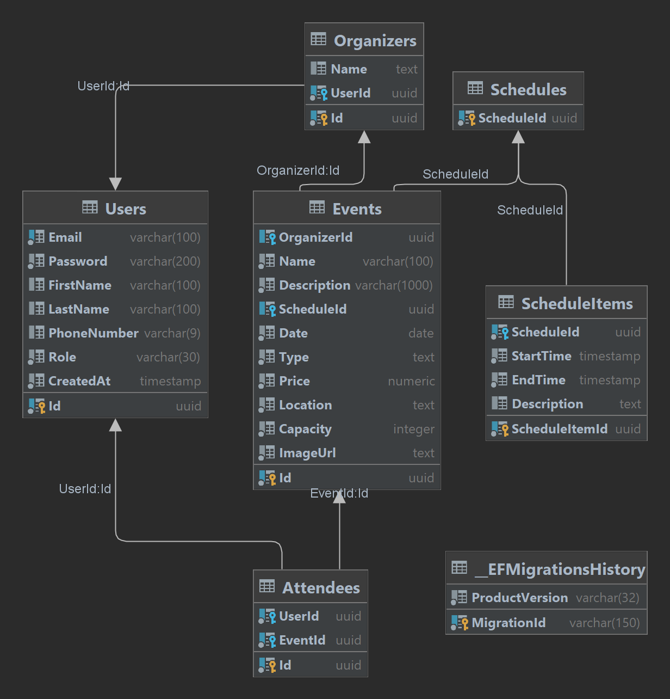

## Zrzuty ekranu
### Strona startowa

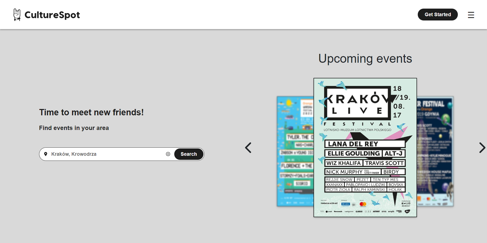

### Rejestracja

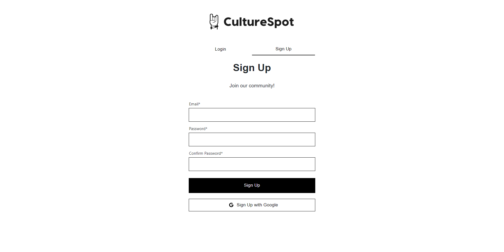

### Logowanie

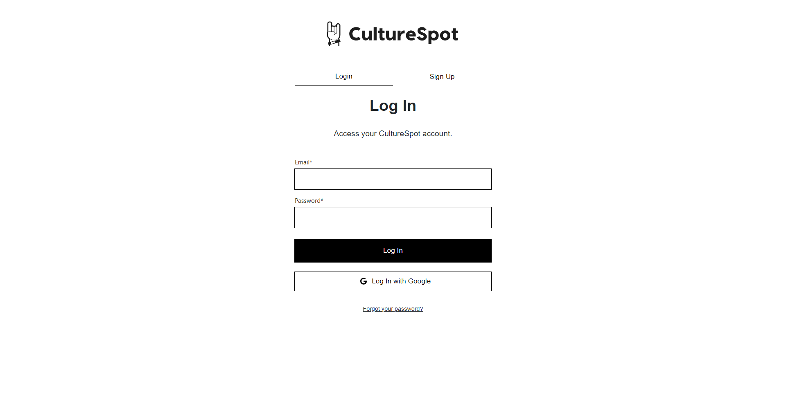

### Walidacja

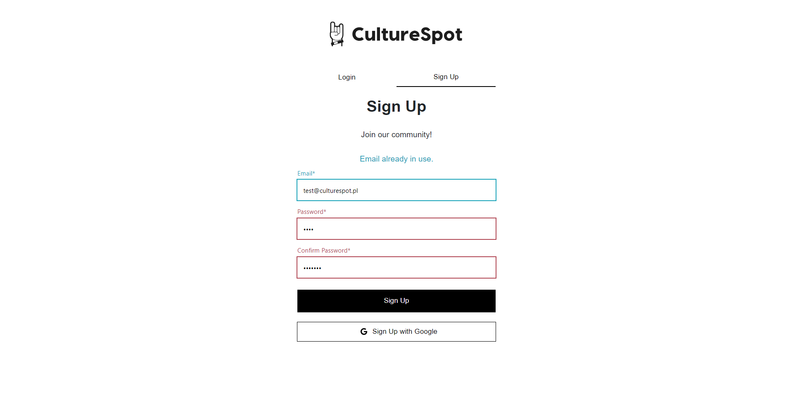

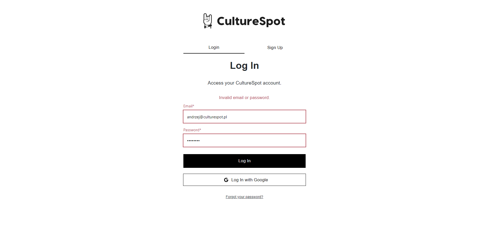

### Strona główna

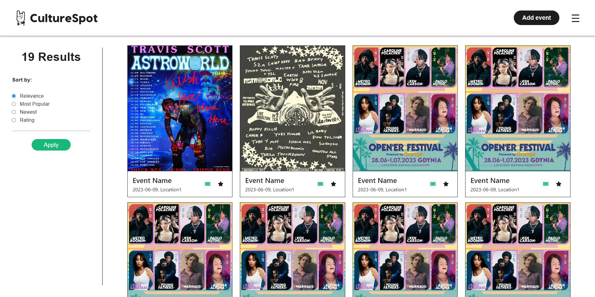

### Tworzenie nowego wydarzenia

- Podstawowe informacje

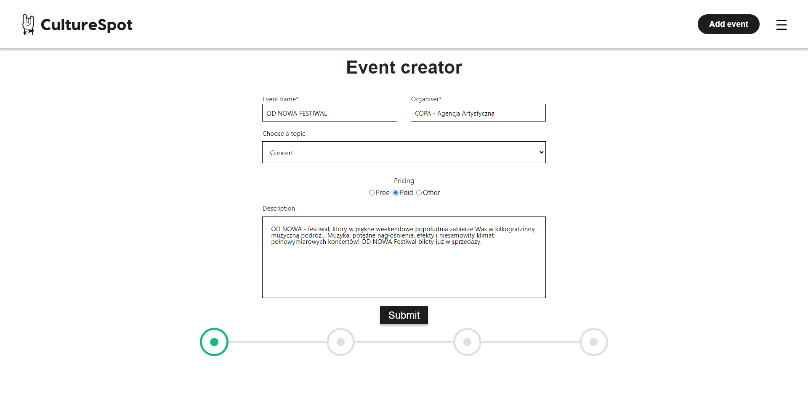

- Tworzenie harmongoramu

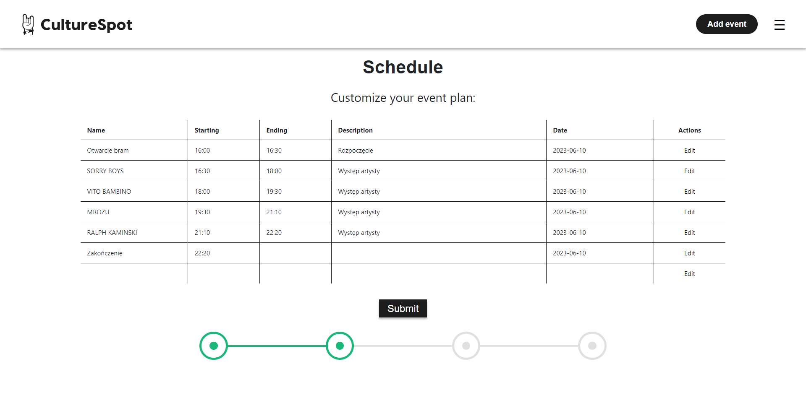

- Dane uzupełniające

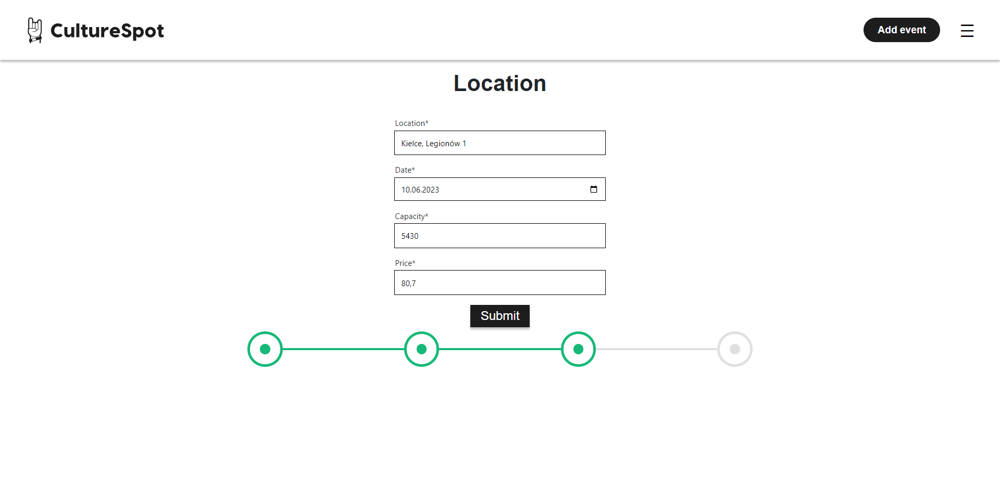

- Upload plakatu wydarzenia

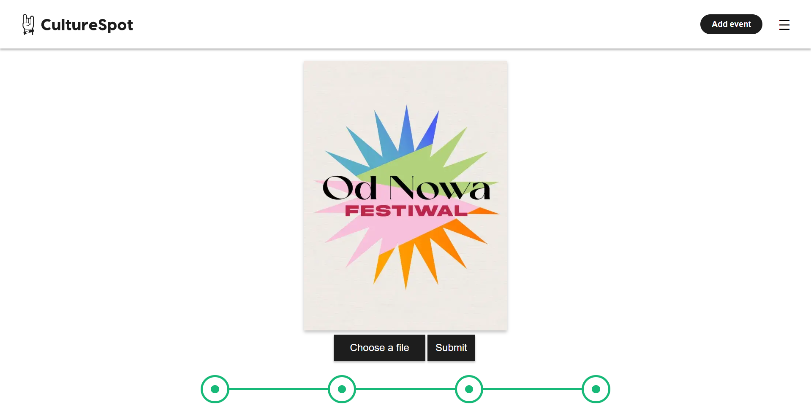
